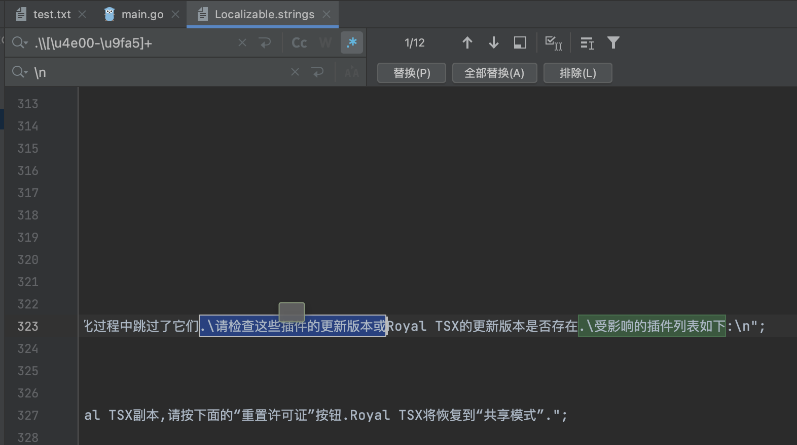
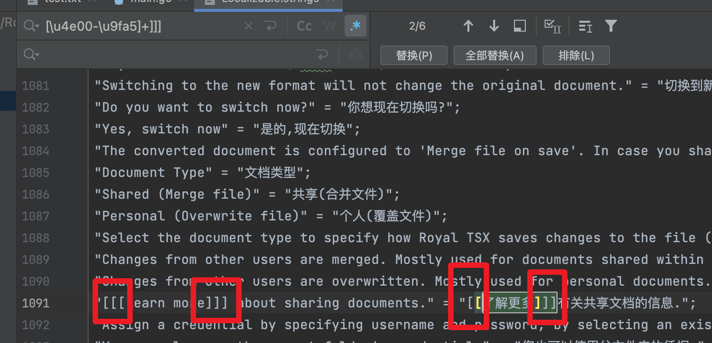
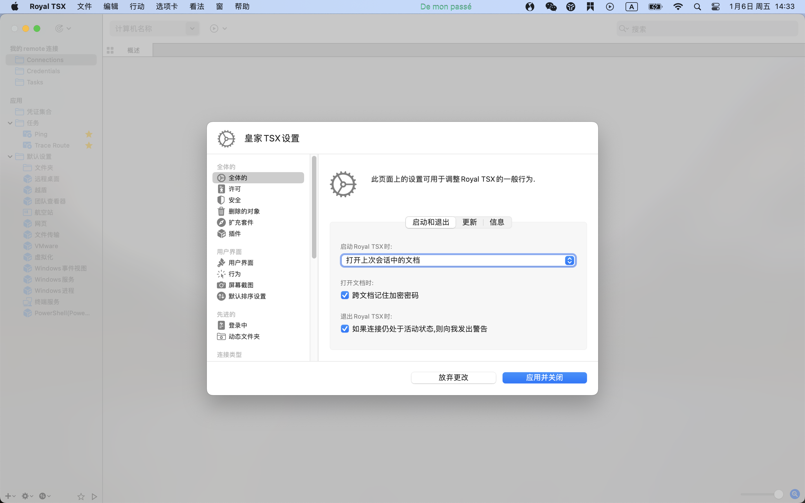

# Royal_TSX 中文翻译golang程序

> 当前项目的翻译文件仅Mac系统下可用

`zh_Hans.lproj/Localizable.settings`是我已经翻译并修正报错字符的文件，可直接使用，但是不保证翻译的完全正确性。

翻译文件使用:

```text
拷贝`zh_Hans.lproj`整个目录至 `/Applications/Royal TSX.app/Contents/Resources`

或者

打开`访达`,选择应用程序，找到`Royal_TSX`打开包内容找到对应目录，并粘贴文件夹。
```

---

> 翻译平台

项目采用了百度翻译api进行翻译，也可以使用其他翻译平台。

使用百度翻译重新进行翻译的话需要一下步骤

1. 配置本地环境变量:`BAIDU_APP_ID`和`BAIDU_KEY`，这个环境变量是`百度`的

2. 然后执行命令运行自动翻译程序
```text
$ go mod tidy

$ go run main.go
```

⚠️注意：

1. 中文翻译后需要修改的地方有很多，由于中文的标点符号是全角类型的。需要将标点符号转换为半角。
2. 需要检查`\n` `<a href=\"{0}\">***</a>"` `[[[` `]]]`等特殊表示符号在翻译后的准确性


如果你想使用其他平台的翻译功能：

1. 实现`net.Translator`接口，在`net.TranslatorProxy#Translation()`中进行替换调度即可。

2. 运行`main.go`


---
>特殊翻译修改检查





>如果你打开Royal之后没有呈现中文，说明翻译后的一些特殊标点符号没有修正。

